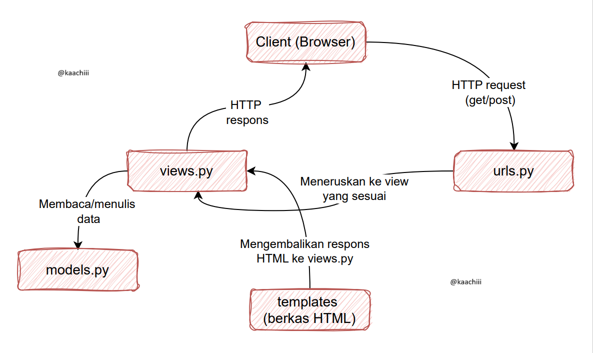
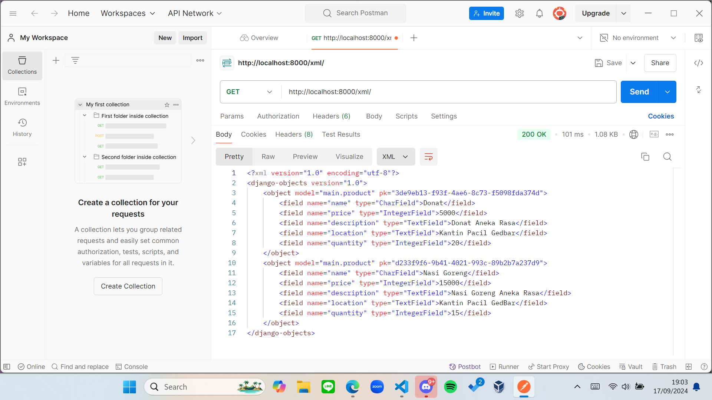
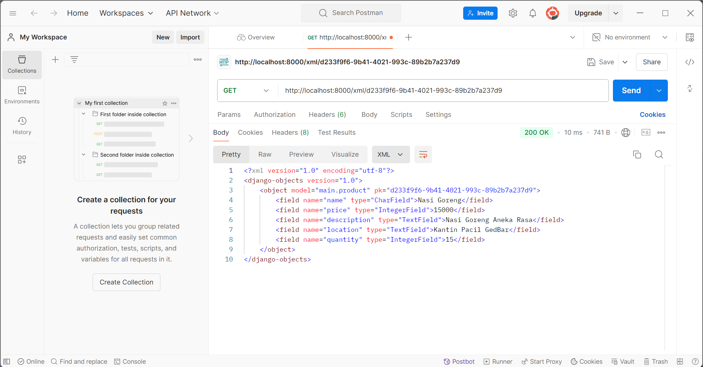
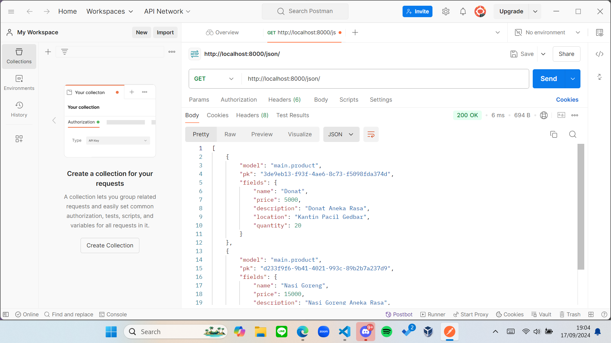
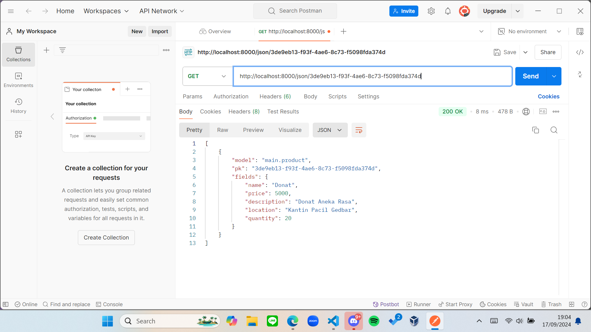

# Hello! Welcome to [*Lazacil*](http://ischika-afrilla-lazacil.pbp.cs.ui.ac.id)
### Siap melayani para lazy pacil 😎🤞

---------------------------------------------------------------------------------------------------------------------------------------------------
> Sebuah proyek Django sederhana sebagai tugas mata kuliah Pemrograman Berbasis Platform (PBP) oleh Ischika Afrilla 2306227955. Proyek ini dibuat dengan sistem operasi Windows.
---------------------------------------------------------------------------------------------------------------------------------------------------

# Daftar Isi
- [Tugas 2](#tugas-2)
- [Tugas 3](#tugas-3)
- [Dokumentasi Postman](#dokumentasi-postman)
- [Tugas 4](#tugas-4)
- [Tugas 5](#tugas-5)
- [Tugas 6](#tugas-6)

## Tugas 2
[Back](#daftar-isi)

1. Jelaskan bagaimana cara kamu mengimplementasikan checklist di atas secara *step-by-step* (bukan hanya sekadar mengikuti tutorial).

    Awalnya, saya membuat folder bernama "lazacil" di direktori lokal komputer dan membuka *Command Prompt* (cmd) di dalam direktori tersebut untuk membuat *virtual environment*. Setelah itu, saya membuat file `requirements.txt` yang berisi daftar *dependencies* yang diperlukan. Setelah proyek Django "lazacil" dibuat, saya mengonfigurasi bagian `ALLOWED_HOSTS` di file `settings.py`, menjalankan server, dan mengakses *localhost* untuk memastikan proyek berjalan dengan baik.

    Setelah semua konfigurasi awal selesai, saya menghentikan server, menonaktifkan *virtual environment*, dan menambahkan file `.gitignore`. Kemudian, saya mengunggah kode proyek ke GitHub. Selanjutnya, saya mengakses halaman PWS (Pacil Web Service), membuat proyek baru dengan nama "lazacil", dan menambahkan URL deployment PWS ke dalam `ALLOWED_HOSTS`.

    Saya melanjutkan dengan melakukan *push* kode ke PWS, memeriksa status proyek, dan memastikan proyek dapat dibuka melalui browser. Setelah itu, saya mengaktifkan kembali *virtual environment* dan membuat aplikasi baru bernama "main" yang saya tambahkan ke `INSTALLED_APPS`. Di dalam aplikasi tersebut, saya membuat folder "template" dan mengisi file `main.html` sesuai desain yang diinginkan.

    Setelah template selesai, saya membuat model dasar di `models.py` dan menjalankan migrasi untuk menerapkan perubahan. Kemudian, saya membuat fungsi `show_main` untuk merender `main.html` menggunakan data yang sesuai. Setelah fungsi tersebut selesai, saya memodifikasi template agar dapat menampilkan variabel yang didefinisikan.

    Saya mengonfigurasi *routing* dengan membuat `urls.py` di dalam aplikasi "main" dan menghubungkannya dengan fungsi `show_main`. Kemudian, saya menambahkan *routing* tersebut ke file `urls.py` di direktori proyek utama dan mengeceknya di *localhost*. Terakhir, saya membuat *unit test* di `main/tests.py`, menambahkan beberapa tes, dan melakukan *push* kode ke GitHub serta PWS.

2. Buatlah bagan yang berisi request client ke web aplikasi berbasis Django beserta responnya dan jelaskan pada bagan tersebut kaitan antara `urls.py`, `views.py`, `models.py`, dan berkas `html`

    

    - Client (Browser) Mengirim HTTP Request

      Client mengirimkan request ke server Django. Permintaan ini bisa berupa request get (meminta data) atau post (mengirimkan data). 
    - urls.py (Routing)

      File `urls.py` bertugas melakukan routing, yaitu menentukan request yang masuk dari URL yang mana akan ditangani oleh view tertentu. 
    - views.py (Logika Program)

      Setelah request diteruskan dari `urls.py`, fungsi yang ada di `views.py` akan dipanggil. View ini berfungsi sebagai logika yang mengatur apa yang harus dilakukan. View bisa mengambil data dari database menggunakan `models.py` (jika diperlukan), kemudian meneruskannya ke template (berkas HTML) untuk dirender, atau langsung mengembalikan respons.
    - models.py (Berinteraksi dengan Database)

      Jika view membutuhkan data dari database, maka view akan berkomunikasi dengan `models.py`. Model bertugas untuk mendefinisikan struktur database, memetakan tabel di database, dan menyediakan fungsi untuk query data.
    - Berkas HTML (Template)

      Setelah data diproses di view, Django akan meneruskannya ke template HTML untuk ditampilkan ke user. Template ini berisi HTML dan bisa menyertakan variabel yang dikirim dari view.
    - HTTP Response

      Setelah template dirender, hasilnya akan dikirim kembali ke client sebagai HTTP Response. Isi dari respons ini biasanya berupa halaman HTML yang dapat ditampilkan di browser.
    - Client (Browser) Menerima HTTP Response

      Setelah server Django mengembalikan respons dalam bentuk HTML, browser akan menampilkan halaman tersebut ke user.

3. Jelaskan fungsi git dalam pengembangan perangkat lunak!

    Fungsi git dalam pengembangan perangkat lunak adalah sebagai berikut.
    - Pengelolaan Versi Kode

      Git memungkinkan *developer* melacak perubahan kode yang dibuat selama proses pengembangan. Setiap perubahan disimpan sebagai *commit* yang berisi informasi tentang apa yang diubah, oleh siapa, dan kapan. Ini membantu dalam memantau dan mengontrol evolusi perangkat lunak dari waktu ke waktu.
    - Kolaborasi Tim

      Git memungkinkan banyak *developer* bekerja pada proyek yang sama secara bersamaan. Dengan fitur *branching* (percabangan), setiap *developer* bisa mengerjakan fitur atau perbaikan tertentu di cabang terpisah tanpa mengganggu kode utama. Setelah selesai, mereka bisa menggabungkan (*merge*) perubahan ke cabang utama (biasanya *main* atau *master*).
    - Pemulihan dari Kesalahan

      Karena Git mencatat setiap perubahan yang dilakukan, *developer* dapat dengan mudah mengembalikan (*revert*) kode ke versi sebelumnya jika ada kesalahan atau bug yang muncul. Ini memberikan keamanan dalam pengembangan karena kode sebelumnya tidak akan hilang.
    - Integrasi dengan Layanan Cloud (GitHub, GitLab, Bitbucket)

      Git memungkinkan *developer* menyimpan proyek mereka di layanan penyimpanan cloud seperti GitHub atau GitLab, yang mendukung pengembangan perangkat lunak secara kolaboratif melalui akses jarak jauh. Hal ini memudahkan tim yang tersebar di berbagai lokasi untuk berkolaborasi secara efektif.
    - Branching dan Merging

      Git menyediakan mekanisme untuk membuat percabangan (*branching*), di mana *developer* bisa mengerjakan fitur baru, melakukan eksperimen, atau memperbaiki bug tanpa mengganggu kode utama. Setelah selesai, percabangan tersebut dapat digabungkan (*merge*) kembali ke cabang utama dengan aman. Ini mendukung pengembangan paralel secara efisien.
    - Manajemen Kontribusi Terbuka

      Dalam proyek perangkat lunak *open-source*, Git sangat berguna karena memungkinkan *developer* dari seluruh dunia untuk berkontribusi. *Developer* bisa melakukan *fork* (menyalin) proyek, mengembangkan perubahan, dan mengirimkan *pull request* untuk menggabungkan kontribusi mereka ke dalam proyek asli.
    - Dokumentasi Perubahan (Commit History)

      Setiap perubahan kode yang dilakukan dalam Git disertai dengan pesan *commit*. Ini membentuk sejarah perubahan (*commit history*) yang memudahkan *developer* lain untuk melihat perkembangan proyek, memahami alasan perubahan tertentu, dan melacak siapa yang mengerjakan apa.
    - Integrasi dengan CI/CD

      Git sering diintegrasikan dengan alat Continuous Integration/Continuous Deployment (CI/CD) seperti Jenkins, Travis CI, atau GitLab CI. Ini memungkinkan otomatisasi pengujian dan *deployment* setiap kali ada perubahan kode yang digabungkan ke cabang utama.

4. Menurut Anda, dari semua framework yang ada, mengapa framework Django dijadikan permulaan pembelajaran pengembangan perangkat lunak?

    Django dijadikan permulaan pembelajaran pengembangan perangkat lunak karena alasan berikut.
    - Pendekatan "Batteries Included" (Fitur Lengkap)

      Django menawarkan banyak fitur bawaan yang lengkap, seperti autentikasi pengguna, pengelolaan URL, ORM (Object-Relational Mapping), dan admin panel. Ini membantu pemula karena mereka tidak perlu memulai dari nol atau mencari banyak *library* tambahan. Dengan Django, mereka dapat langsung fokus pada logika aplikasi, bukan pada hal-hal teknis dasar.
    - Arsitektur yang Terstruktur (MTV Pattern)

      Django mengikuti pola *Model-Template-View* (MTV), yang serupa dengan pola MVC (*Model-View-Controller*). Arsitektur ini membagi aplikasi menjadi beberapa komponen, membuatnya lebih terorganisir dan mudah dipahami. Bagi pemula, ini membantu dalam membangun fondasi yang kuat untuk memahami bagaimana aplikasi web bekerja dan bagaimana memisahkan berbagai bagian dari sebuah aplikasi (data, logika, tampilan).
    - Dokumentasi yang Lengkap

      Django memiliki dokumentasi yang sangat lengkap dan ramah bagi pemula. Banyak materi pembelajaran, tutorial, dan komunitas yang mendukung, yang memudahkan pemula untuk mempelajari Django dengan cepat. Dokumentasi yang baik memastikan bahwa *developer* dapat menyelesaikan masalah mereka tanpa harus bergantung pada sumber eksternal.
    - Keamanan Tinggi

      Django dilengkapi dengan fitur keamanan yang canggih, seperti perlindungan terhadap serangan *SQL Injection*, *Cross-Site Scripting* (XSS), dan *Cross-Site Request Forgery* (CSRF). Bagi pemula, memulai dengan framework yang aman membantu mereka belajar praktik pengembangan aplikasi web yang baik sejak awal.
    - Skalabilitas

      Django tidak hanya cocok untuk proyek kecil, tetapi juga dapat digunakan untuk proyek besar. Ini memungkinkan *developer* yang baru belajar untuk membangun proyek skala kecil, tetapi tetap memberi mereka ruang untuk mengembangkan keterampilan dan proyek mereka ke tingkat yang lebih kompleks di masa depan.
    - Dukungan untuk Proyek Cepat (Prototyping)

      Django memungkinkan *developer* untuk membuat aplikasi yang berfungsi dengan cepat. Dengan fitur seperti ORM, sistem templating, dan admin panel bawaan, *developer* pemula dapat membuat prototipe aplikasi dengan cepat tanpa harus menulis banyak kode dari awal.
    - Berorientasi pada Pengalaman Nyata

      Django digunakan oleh banyak perusahaan besar untuk aplikasi skala besar (seperti Instagram, Pinterest, dan Mozilla). Belajar Django memberi pemula pengalaman langsung dengan alat yang digunakan di industri, sehingga keterampilan yang mereka pelajari langsung relevan dengan pekerjaan nyata.
    - Python sebagai Bahasa Dasar

      Django dibangun menggunakan Python, yang merupakan salah satu bahasa pemrograman paling populer dan mudah dipelajari. Python dikenal karena sintaksnya yang sederhana dan bersih, yang menjadikannya pilihan ideal bagi mereka yang baru memulai pemrograman. Selain itu, popularitas Python di berbagai bidang seperti *data science* dan *machine learning* membuat Django menjadi pilihan yang menarik untuk pengembangan aplikasi web di ekosistem Python.
    - Komunitas yang Besar

      Django memiliki komunitas yang besar dan aktif. *Developer* pemula dapat dengan mudah menemukan jawaban atas masalah mereka melalui forum, kelompok belajar, atau repositori *open-source*. Komunitas yang kuat memberikan dukungan tambahan di luar dokumentasi resmi.
    - Keterampilan yang Mudah Ditransfer

      Setelah mempelajari Django, konsep-konsep seperti pemisahan logika aplikasi dan tampilan, manipulasi database, dan pola desain yang dipakai oleh Django bisa dengan mudah ditransfer ke *framework* lain atau bahkan teknologi lain di luar Python.

5. Mengapa model pada Django disebut sebagai ORM?

    Model pada Django disebut ORM (Object-Relational Mapping) karena Django menggunakan teknik ini untuk memudahkan interaksi antara objek di kode Python dan *database* relasional (seperti MySQL, PostgreSQL, atau SQLite). Dengan ORM, developer bisa bekerja dengan database menggunakan objek dan metode dalam kode tanpa perlu menulis SQL (Structured Query Language), bahasa yang biasa digunakan untuk mengelola *database*. ORM membantu menghubungkan dunia pemrograman berorientasi objek (OOP) dengan tabel di database. Ini membuat pekerjaan *developer* lebih efisien dan interaksi dengan *database* menjadi lebih mudah dan intuitif.

## Tugas 3
[Back](#daftar-isi)

1. Jelaskan mengapa kita memerlukan *data delivery* dalam pengimplementasian sebuah platform?

    *Data delivery* adalah proses pengiriman data dari satu titik ke titik lain, baik antar sistem, aplikasi, atau komponen dalam sebuah platform. *Data delivery* sangat penting dalam pengimplementasian sebuah platform karena memainkan peran kunci dalam memastikan bahwa data yang relevan dan dibutuhkan tersedia tepat waktu, akurat, dan aman bagi pengguna atau sistem lain yang terhubung dengan platform tersebut. Tanpa pengiriman data yang andal dan efisien, platform tidak akan dapat berfungsi secara optimal, mempengaruhi kualitas layanan, keamanan, serta pengalaman pengguna secara keseluruhan.

2. Menurutmu, mana yang lebih baik antara XML dan JSON? Mengapa JSON lebih populer dibandingkan XML?

    Dalam perbandingan antara XML (*eXtensible Markup Language*) dan JSON (*JavaScript Object Notation*), masing-masing memiliki keunggulan dan kelemahan tersendiri. Namun, dalam banyak hal, JSON dianggap lebih baik dan lebih populer daripada XML, terutama dalam konteks *web development* dan API modern karena sintaksis yang lebih sederhana, ukuran data lebih kecil, kinerja *parsing* yang lebih cepat, dukungan luas di API modern, integrasi yang baik dengan JavaScript, tipe data yang lebih kaya dan alami. Sedangkan, XML lebih baik digunakan saat data memerlukan skema yang ketat (*Validation*), data mengandung informasi hirarkis yang kompleks, dan data berbasis teks atau dokumen.

3. Jelaskan fungsi dari method `is_valid()` pada form Django dan mengapa kita membutuhkan method tersebut?


    Method `is_valid()` pada form Django memiliki fungsi utama untuk memeriksa apakah data yang dikirimkan melalui form sesuai dengan aturan validasi yang telah ditetapkan di form tersebut dan menyimpan data yang sudah divalidasi dalam atribut `cleaned_data`. Method ini mengembalikan nilai *True* jika semua data yang dimasukkan valid, dan *False* jika ada kesalahan atau ketidaksesuaian dengan aturan validasi. Saat method `is_valid()` dipanggil, Django akan:
    - Memeriksa apakah semua field yang diperlukan (*required*) telah diisi.
    - Memvalidasi tipe data yang dimasukkan
    - Melakukan validasi khusus

    Method `is_valid()` dibutuhkan untuk:
    - Memastikan pengguna memasukkan data yang tepat
    - Mencegah data yang tidak valid diproses
    - Mendapatkan data yang bersih 

4. Mengapa kita membutuhkan `csrf_token` saat membuat *form* di Django? Apa yang dapat terjadi jika kita tidak menambahkan `csrf_token` pada *form* Django? Bagaimana hal tersebut dapat dimanfaatkan oleh penyerang?

    - Apa itu CSRF (*Cross-Site Request Forgery*)?

      CSRF adalah jenis serangan di mana penyerang memanfaatkan sesi pengguna yang telah diautentikasi di sebuah aplikasi web untuk menjalankan tindakan yang tidak diinginkan, seperti mengubah pengaturan akun, melakukan transaksi, atau mengirimkan data tanpa persetujuan pengguna.

      Misalnya, jika pengguna sudah *login* di sebuah situs perbankan dan membuka halaman berbahaya di tab lain yang dibuat oleh penyerang, halaman berbahaya itu bisa mengirimkan permintaan ke situs perbankan untuk mentransfer uang. Karena browser pengguna mengirimkan *cookie* autentikasi secara otomatis, server perbankan menganggap permintaan tersebut sah, meskipun sebenarnya permintaan itu dikirim oleh penyerang.

    - Mengapa kita membutuhkan `csrf_token` di Django?

      `csrf_token` adalah token unik yang diberikan oleh server kepada *form* HTML untuk memverifikasi bahwa permintaan tersebut berasal dari sumber yang tepercaya (yaitu, dari situs yang sah). Token ini secara acak dihasilkan dan disisipkan ke dalam setiap form yang menggunakan metode POST. Ketika form dikirim, Django akan memverifikasi apakah token yang dikirimkan sesuai dengan token yang dihasilkan sebelumnya. Keberadaan `csrf_token` memastikan bahwa setiap permintaan POST atau form submission yang diterima server benar-benar berasal dari halaman yang dibuat oleh server itu sendiri, bukan dari halaman berbahaya yang dibuat oleh penyerang.

    - Apa yang terjadi jika tidak menambahkan `csrf_token`?

      Jika kita tidak menambahkan `csrf_token` pada form Django, aplikasi web kita menjadi rentan terhadap serangan CSRF. Tanpa perlindungan ini, penyerang dapat dengan mudah memanfaatkan sesi pengguna yang sah untuk melakukan aksi-aksi yang tidak diinginkan.

    - Bagaimana penyerang memanfaatkan ketidakhadiran `csrf_token`?

        - Penyerang membuat halaman berbahaya di situs eksternal yang berisi *form* atau permintaan tersembunyi yang diarahkan ke aplikasi web korban (misalnya, mengirim permintaan POST untuk melakukan transfer uang atau mengubah kata sandi)
        - Penyerang bisa mengelabui pengguna agar mengunjungi halaman tersebut (melalui tautan email, pesan, atau metode *phishing* lainnya). Karena pengguna telah login ke aplikasi web yang sah, browser mereka secara otomatis mengirim *cookie* autentikasi bersama dengan permintaan tersebut.
        - Jika aplikasi tidak memverifikasi asal permintaan dengan menggunakan `csrf_token`, server akan mengeksekusi permintaan tersebut karena browser mengirimkan *cookie* autentikasi pengguna. Hasilnya, penyerang berhasil menjalankan tindakan atas nama pengguna tanpa persetujuan mereka.

    - Bagaimana `csrf_token` mencegah serangan CSRF?

      `csrf_token` mencegah serangan CSRF dengan menambahkan lapisan keamanan tambahan. Setiap *form* di dalam aplikasi yang aman akan berisi token unik yang dihasilkan secara acak oleh server saat halaman *form* dimuat. Token ini juga disimpan di sesi server pengguna. Ketika pengguna mengirimkan *form*, server membandingkan token yang dikirimkan dari *form* dengan token yang disimpan di sesi pengguna. Jika tokennya cocok, permintaan dianggap valid. Jika tidak, permintaan ditolak karena dianggap berasal dari sumber yang tidak sah.

5. Jelaskan bagaimana cara kamu mengimplementasikan *checklist* di atas secara *step-by-step* (bukan hanya sekadar mengikuti tutorial)

    - Membuat `templates/base.html` pada direktori utama (*root folder*) lazacil.
    - Mengedit *templates* pada `lazacil/settings.py` agar `base.html` terdeteksi sebagai *template*.
    - Menambahkan `base.html` sebagai *template* utama pada `main/templates/main.html`.
    - Menghapus berkas basis data (`db.sqlite3`)
    - Mengubah *primary key* menjadi UUID pada `main/models.py`.
    - Melakukan migrasi model kembali.
    - Membuat berkas baru dengan nama `forms.py` pada *main* untuk membuat struktur *form*.
    - Menambahkan `import redirect` pada `main/views.py`.
    - Membuat fungsi `create_product` dengan parameter `request` pada `main/views.py`.
    - Mengedit fungsi `show_main` pada `main/views.py`.
    - Meng*import* fungsi `create_product` pada `main/urls.py`.
    - Menambahkan path URL `create_product` ke dalam `urlpatterns` pada `main/urls.py`.
    - Membuat berkas baru dengan nama `create_product.html` pada `main/templates` dan mengedit `main.html`.
    - Menjalankan pada *localhost* dan mencoba menambahkan beberapa produk.
    - Menambahkan `import HttpResponse` dan `serializers` pada `main/views.py`.
    - Membuat fungsi baru dengan nama `show_xml`, `show_json`, `show_xml_by_id`, `show_json_by_id` pada `main/views.py` lalu import fungsi tersebut ke `main/urls.py` dan menambahkan path URL-nya ke dalam `urlpatterns`.
    - Menjalankan pada *localhost* dan mencoba mengecek hasil datanya.
    - Mengecek pengambilan data pada Postman dan terakhir *push* kode ke GitHub dan PWS.

## Dokumentasi Postman
[Back](#daftar-isi)

### XML

### XML by ID

### JSON

### JSON by ID


## Tugas 4
[Back](#daftar-isi)

1. Apa perbedaan antara `HttpResponseRedirect()` dan `redirect()`?

    - Fungsi Dasar:
      - `HttpResponseRedirect()`: Kelas bawaan Django yang digunakan untuk mengembalikan respons pengalihan HTTP dengan status kode 302 (*Found*). Ini mengharuskan kita untuk secara eksplisit menyertakan URL tujuan sebagai argumen saat menggunakannya.
      - `redirect()`: Fungsi utilitas Django yang secara internal menggunakan `HttpResponseRedirect()`, tetapi menyediakan fleksibilitas tambahan. Fungsi ini lebih cerdas karena memungkinkan kita untuk mengoper URL, nama pola URL, atau bahkan objek model, dan Django akan mengonversinya menjadi URL yang sesuai.
    - Penggunaan
      - `HttpResponseRedirect()`: Mengharuskan URL lengkap atau relatif diberikan secara manual, biasanya digunakan untuk *redirect* sederhana ke URL tertentu.
      - `redirect()`: Lebih fleksibel dan mendukung berbagai tipe input seperti URL *string*, nama URL, atau objek.
    - Fleksibilitas
      - `HttpResponseRedirect()`: Hanya dapat digunakan untuk URL *string*, sehingga tidak bisa menggunakan nama pola URL atau objek model.
      - `redirect()`: Dapat menerima berbagai argumen, seperti URL *string* langsung, nama pola URL yang ada di `urls.py`, dan objek model yang memiliki *method* get_absolute_url().
    - Kenyamanan
      - `HttpResponseRedirect()`: Kurang praktis karena kita harus secara manual membangun URL atau mengonversi URL.
      - `redirect()`: Lebih mudah digunakan karena mengurangi kebutuhan untuk membangun URL secara manual. Django akan melakukan semua konversi jika kita ingin mengarahkan ke nama URL yang ada atau objek model.

    Fungsi `redirect()` lebih umum digunakan karena memberikan kemudahan dan fleksibilitas yang lebih besar.

2. Jelaskan cara kerja penghubungan model `Product` dengan `User`!

    Untuk menghubungkan model `Product` dengan model `User` di Django, kita biasanya menggunakan relasi `ForeignKey`. Ini adalah cara yang umum untuk mendefinisikan hubungan *many-to-one*, di mana satu pengguna dapat memiliki banyak produk, tetapi setiap produk hanya dimiliki oleh satu pengguna. Cara kerja penghubungan model `Product` dengan `User` adalah sebagai berikut:
    - Membuat Model

      Pertama, kita harus mendefinisikan model `User` dan `Product`. Django sudah menyediakan model `User` dalam `django.contrib.auth.models` sehingga kita dapat langsung menggunakannya.
    - Migrasi

      Setelah mendefinisikan model, langkah selanjutnya adalah melakukan migrasi untuk menerapkan perubahan ke *database*.
    - Menggunakan Model

      Setelah model dan migrasi selesai, kita dapat mulai menggunakan model ini dalam `views.py`.
    - Mengambil Produk Milik Pengguna

      Untuk mengambil semua produk milik pengguna tertentu, kita dapat melakukannya dengan cara:
      ```python
      def show_main(request):
          products = Product.objects.filter(user=request.user)
      ```


3. Apa perbedaan antara *authentication* dan *authorization*, apakah yang dilakukan saat pengguna *login*? Jelaskan bagaimana Django mengimplementasikan kedua konsep tersebut!

    **Authentication**
      - Definisi: Proses memverifikasi identitas pengguna, biasanya dengan memeriksa kredensial seperti *username* dan *password*.
      - Cara Kerja: Pengguna memberikan kredensial (*username* dan *password*) yang kemudian dicocokkan dengan data yang tersimpan di *database*. Jika cocok, pengguna dianggap terautentikasi.
      - Tujuan: Memastikan bahwa orang yang mengakses aplikasi adalah orang yang memang berhak mengakses.

    **Authorization**
      - Definisi: Proses yang menentukan hak akses pengguna setelah mereka berhasil diautentikasi, seperti izin untuk mengakses fitur atau halaman tertentu.
      - Cara Kerja: Setelah identitas pengguna terverifikasi, sistem akan memeriksa peran atau izin yang dimiliki pengguna. Berdasarkan peran atau izin tersebut, sistem akan menentukan tindakan apa saja yang boleh dilakukan oleh pengguna.
      - Tujuan: Memastikan bahwa pengguna hanya dapat mengakses fitur dan data yang sesuai dengan perannya.

    Ketika pengguna login yang dilakukan adalah:
      - Klien mengirimkan permintaan: Browser mengirimkan permintaan ke server dengan data *login* pengguna.
      - Server memverifikasi kredensial: Server menerima permintaan, mengambil data pengguna dari *database*, dan membandingkan dengan kredensial yang diberikan.
      - *Authentication* berhasil: Jika cocok, server akan membuat sesi untuk pengguna tersebut dan mengirimkan *cookie* sesi ke browser.
      - *Authorization*: Server akan memeriksa peran atau izin pengguna dan menentukan halaman atau fitur apa yang dapat diakses oleh pengguna.
      - Pengalihan: Browser akan diarahkan ke halaman yang sesuai dengan *authorization* pengguna.

    **Authentication di Django**

    Django memiliki sistem autentikasi bawaan yang menyediakan berbagai fungsi dan mekanisme untuk mengelola *login*, *logout*, dan manajemen pengguna.
      - *User Model*: Django memiliki model pengguna default (`django.contrib.auth.models.User`) yang menyimpan informasi pengguna seperti *username*, *password* (terenkripsi), email, dan status.
      - *Login*: Fungsi login di Django (misalnya `django.contrib.auth.login()`) menangani proses autentikasi pengguna. Proses *login* memvalidasi kredensial pengguna dan membuat *session* yang menyimpan informasi pengguna yang sudah diautentikasi.
      - *Session*: Setelah pengguna berhasil *login*, Django menggunakan *session* (dikelola melalui *cookies*) untuk menyimpan informasi bahwa pengguna tersebut sudah diautentikasi pada *request* berikutnya.

    **Authorization di Django**

    Authorization di Django dikontrol melalui *permissions* (izin) dan *groups* (kelompok pengguna). Django memberikan kontrol akses berbasis peran dengan menggunakan mekanisme berikut:
      - *Permissions*: Setiap pengguna di Django dapat diberikan izin tertentu. Django secara otomatis memberikan izin untuk *add, change, delete,* dan *view* pada model tertentu. Izin-izin ini bisa diperluas sesuai kebutuhan.
      - *Groups*: Django mendukung manajemen pengguna berdasarkan grup. Setiap grup bisa memiliki sekumpulan izin yang kemudian bisa diberikan kepada anggota grup. Ini memudahkan pengelolaan *authorization* untuk banyak pengguna yang memiliki peran serupa. Misalnya, kita bisa membuat grup "Admin" dengan akses penuh dan grup "Pengguna Biasa" dengan akses terbatas.
      - *Decorators*: Django menyediakan *decorators* yang memudahkan kontrol *authorization* di level *view*. Beberapa yang umum digunakan adalah:
        - `@login_required`: Memastikan bahwa hanya pengguna yang telah *login* yang bisa mengakses *view* tersebut.
        - `@permission_required`: Memastikan pengguna memiliki izin tertentu sebelum mengakses *view*.
      - Peran Pengguna: Django juga memungkinkan pengelolaan peran pengguna dengan `field is_staff` dan `is_superuser`.

    Kesimpulan: Django mengimplementasikan *authentication* melalui fungsi `authenticate()` dan `login()`, sedangkan *authorization* melalui izin, grup, serta *decorator* seperti `@login_required` dan `@permission_required`.

4. Bagaimana Django mengingat pengguna yang telah *login*? Jelaskan kegunaan lain dari *cookies* dan apakah semua *cookies* aman digunakan?

    Django mengingat pengguna yang telah *login* menggunakan *session* yang dihubungkan dengan *cookies*. Ketika seorang pengguna berhasil *login*, Django menciptakan sebuah *session ID* yang unik dan menyimpannya dalam basis data atau penyimpanan lain (seperti *cache* atau file), tergantung pada konfigurasi. *Session ID* ini kemudian disimpan di sisi pengguna dalam bentuk *cookie*. *Cookie* ini adalah *cookie session* yang memiliki nama standar `sessionid`. Setiap kali pengguna melakukan *request* ke server, Django membaca *session ID* dari *cookie* ini untuk mengetahui siapa yang sedang berinteraksi dengan aplikasi.

    Kegunaan lain *cookies*:
      - Menyimpan Preferensi Pengguna
      - Pelacakan Aktivitas Pengguna
      - *Authentication* dan *Authorization*
      - *Shopping Cart* di *E-commerce*
      - Personalisasi Konten

    Tidak semua *cookies* aman. Ada beberapa masalah keamanan yang berkaitan dengan penggunaan *cookies*:
      - *Cookies* Dapat Diakses oleh Pihak Ketiga
      - *Cookies* Dapat Disalahgunakan untuk Pelacakan
      - *Cookies* Terkena Serangan *Cross-Site Request Forgery* (CSRF)
      - *Cookies* yang Berumur Panjang (*Persistent Cookies*)

5. Jelaskan bagaimana cara kamu mengimplementasikan *checklist* di atas secara *step-by-step* (bukan hanya sekadar mengikuti tutorial)!

    - Buka `main/views.py` lalu tambahkan *import* `UserCreationForm` dan `messages` serta fungsi `register`.
    - Buat berkas HTML baru dengan nama `register.html` pada `main/templates`.
    - Buka `main/urls.py` dan *import* fungsi `register` dari `main/views.py` serta tambahkan *path url* ke dalam `urlpatterns`.
    - Buka `main/views.py` lalu tambahkan *import* `authenticate`, `login`, dan `AuthenticationForm` serta fungsi `login_user`.
    - Buat berkas HTML baru dengan nama `login.html` pada `main/templates`.
    - Buka `main/urls.py` dan *import* fungsi `login_user` dari `main/views.py` serta tambahkan *path url* ke dalam `urlpatterns`.
    - Buka `main/views.py` lalu tambahkan *import* `logout` serta fungsi `logout_user`.
    - Buka `main/templates/main.html` dan tambahkan potongan kode berikut untuk `logout`.
      ```html
      ...
      <a href="">
        <button>Logout</button>
      </a>
      ...
      ```
    - Buka `main/urls.py` dan *import* fungsi `logout_user` dari `main/views.py` serta tambahkan *path url* ke dalam `urlpatterns`.
    - Buka `main/views.py` lalu tambahkan *import* `login_required` serta `@login_required(login_url='/login')` di atas fungsi `show_main`.
    - Jalankan dan cek pada *localhost*.
    - Buka `main/views.py` lalu tambahkan *import* `HttpResponseRedirect`, `reverse`, dan `datetime` serta *cookie* yang bernama `last_login` pada fungsi `login_user`, `show_main`, dan `logout_user`.
    - Buka `main/templates/main.html` dan tambahkan potongan kode berikut untuk `last_login`.
      ```html
      ...
      <h5>Sesi terakhir login: {{ last_login }}</h5>
      ...
      ```
    - Jalankan dan cek cookie pada *localhost*.
    - Buka `main/models.py` lalu tambahkan *import* `User` serta `ForeignKey` pada *class* `Product`.
    - Buka `main/views.py` dan tambahkan kode berikut agar kita dapat menandakan kepemilikan produk serta ganti fungsi `show_main` agar hanya menampilkan produk dan nama pengguna yang sedang *login*.

      ```python
      def create_product(request):
          form = ProductForm(request.POST or None)
          
          if form.is_valid() and request.method == "POST":
              mood_entry = form.save(commit=False)
              mood_entry.user = request.user
              mood_entry.save()
              return redirect('main:show_main')

          context = {'form': form}
          return render(request, "create_product.html", context)
      ```
    - Pastikan sudah ada minimal 1 *user* pada *database* lalu lakukan migrasi model seperti biasa.
    - Buka `lazacil/settings.py` lalu tambahkan *import* `os` dan ganti variabel `DEBUG` menjadi seperti kode berikut:
      ```python
        PRODUCTION = os.getenv("PRODUCTION", False)
        DEBUG = not PRODUCTION
      ```
    - Jalankan dan cek hasil pada *localhost* lalu push ke GitHub dan PWS seperti biasa.

## Tugas 5
[Back](#daftar-isi)

1. Jika terdapat beberapa CSS selector untuk suatu elemen HTML, jelaskan urutan prioritas pengambilan CSS selector tersebut!

    Urutan prioritas pengambilan CSS selector ditentukan oleh beberapa faktor, yaitu spesifisitas, urutan deklarasi, dan penggunaan properti !important. Berikut adalah penjelasan dari faktor-faktor tersebut:

    - Spesifisitas (*Specificity*)

      Tingkat spesifisitas dibagi menjadi empat bagian utama:

        - ID Selector (`#id`): Memiliki prioritas tinggi.
        - Class, Attribute, dan Pseudo-class Selector (`.class`, `[attribute]`, `:hover`): Memiliki prioritas sedang.
        - Tag atau Type Selector (`tag`, seperti `div`, `p`, `span`): Memiliki prioritas rendah.
        - Universal Selector (`*`), combinator (`+`, `>`, `~`), dan negasi (`:not()`): Tidak berkontribusi pada nilai spesifisitas.

      Tingkat spesifisitas dihitung dalam bentuk tuple, dan angka-angka ini dibandingkan dari kiri ke kanan (ID, Class, Tag). Selector dengan spesifisitas lebih tinggi akan diutamakan.

    - Urutan Deklarasi (*Source Order*)
    
      Jika dua atau lebih selector memiliki spesifisitas yang sama, maka yang berlaku adalah selector yang dideklarasikan terakhir di dalam file CSS atau yang diimpor terakhir.

    - Penggunaan `!important`

      Aturan yang menggunakan `!important` akan mengesampingkan semua aturan lainnya, terlepas dari spesifisitasnya. Namun, jika dua aturan yang saling bertentangan sama-sama menggunakan `!important`, maka spesifisitas tetap akan menjadi penentu.

    - Inline Style

      Gaya yang didefinisikan langsung pada elemen HTML menggunakan atribut `style` memiliki prioritas yang sangat tinggi, mengesampingkan selector yang berada di stylesheet eksternal atau internal, kecuali ada penggunaan `!important`.

    - Prioritas dari *User-Agent Stylesheet*

      Setiap browser memiliki *default stylesheet* (dikenal sebagai *user-agent stylesheet*). Jika tidak ada aturan CSS yang diterapkan, aturan dari browser akan digunakan. Namun, jika ada aturan CSS yang didefinisikan oleh *developer*, maka ini akan mengesampingkan *user-agent stylesheet*.

2. Mengapa *responsive design* menjadi konsep yang penting dalam pengembangan aplikasi *web*? Berikan contoh aplikasi yang sudah dan belum menerapkan *responsive design*!

    Responsive design adalah konsep desain yang bertujuan agar tampilan dan fungsi sebuah *website* dapat menyesuaikan secara optimal di berbagai perangkat dengan ukuran layar dan resolusi yang berbeda, seperti *desktop*, *tablet*, dan *smartphone*. Ini menjadi penting dalam pengembangan aplikasi *web* karena beberapa alasan utama, yaitu:

    - Peningkatan penggunaan perangkat *mobile*
    - Pengalaman pengguna (*user experience*) yang konsisten
    - SEO (*Search Engine Optimization*)
    - Efisiensi pengembangan
    - Peningkatan konversi dan retensi

    Contoh aplikasi yang sudah menerapkan *responsive design*:
    - Facebook
    - Airbnb
    - X

    Contoh aplikasi yang belum menerapkan *responsive design*:
    - Situs web tua yang tidak di-*update*
    - Situs pemerintah yang tertinggal

3. Jelaskan perbedaan antara *margin*, *border*, dan *padding*, serta cara untuk mengimplementasikan ketiga hal tersebut!

    - **Margin**

      *Margin* adalah ruang di luar elemen, digunakan untuk memberikan jarak antara satu elemen dengan elemen lain. *Margin* bersifat transparan dan tidak memiliki warna atau properti visual lainnya.
        - Fungsi: Mengatur jarak antar elemen di luar area konten dan batas elemen.
        - Properti CSS:
          - `margin-top`: Mengatur margin di bagian atas elemen.
          - `margin-right`: Mengatur margin di bagian kanan elemen.
          - `margin-bottom`: Mengatur margin di bagian bawah elemen.
          - `margin-left`: Mengatur margin di bagian kiri elemen.
          - `margin`: Mengatur semua sisi margin sekaligus (*top, right, bottom, left*).

        ```css
        div {
        margin: 20px; /* Semua sisi memiliki margin 20px */
        }

        p {
        margin: 10px 5px 15px 0; /* Top: 10px, Right: 5px, Bottom: 15px, Left: 0 */
        }
        ```

    - **Border**

      *Border* adalah garis di sekeliling elemen yang mengelilingi *padding* dan konten. *Border* terletak di antara *padding* dan *margin*, serta dapat diberi warna, ketebalan, dan gaya (seperti *solid*, *dotted*, *dashed*, dll.).
        - Fungsi: Memberikan batas visual pada elemen, yang bisa berfungsi sebagai dekorasi atau untuk memisahkan konten.
        - Properti CSS:
          - `border-width`: Mengatur ketebalan garis batas.
          - `border-style`: Mengatur gaya garis batas (*solid, dotted, dashed,* dll.).
          - `border-color`: Mengatur warna garis batas.
          - `margin-left`: Mengatur margin di bagian kiri elemen.
          - `border`: Properti shorthand yang menggabungkan `border-width`, `border-style`, dan `border-color`.

        ```css
        div {
        border: 2px solid black; /* Ketebalan 2px, garis solid, warna hitam */
        }

        p {
        border-top: 5px dashed red; /* Hanya border atas yang bergaya dashed dengan warna merah */
        }
        ```

    - **Padding**

      *Padding* adalah ruang di dalam elemen, antara konten elemen dan batas (*border*). *Padding* bersifat transparan, tetapi bisa diperluas dan memiliki warna latar belakang yang sama dengan elemen tersebut. Jika elemen memiliki latar belakang, maka latar belakang akan meluas hingga ke *padding*.
        - Fungsi: Memberikan ruang di dalam elemen agar konten tidak menempel langsung ke border.
        - Properti CSS:
          - `padding-top`: Mengatur *padding* di bagian atas.
          - `padding-right`: Mengatur *padding* di bagian kanan.
          - `padding-bottom`: Mengatur *padding* di bagian bawah.
          - `padding-left`: Mengatur *padding* di bagian kiri.
          - `padding`: Mengatur semua sisi *padding* sekaligus (*top, right, bottom, left*).

        ```css
        div {
        padding: 10px; /* Semua sisi memiliki padding 10px */
        }

        p {
        padding: 5px 10px 15px 20px; /* Top: 5px, Right: 10px, Bottom: 15px, Left: 20px */
        }   
        ```

    **Cara Kerja Bersama: Model Kotak CSS (CSS Box Model)**
    
    Ketika digabungkan, *margin*, *border*, dan *padding* membentuk *box model* yang digunakan oleh *browser* untuk merender elemen. *Box model* terdiri dari:
      - *Content*: Area di mana teks, gambar, atau elemen lain ditampilkan.
      - *Padding*: Ruang di antara konten dan border.
      - *Border*: Garis yang mengelilingi padding dan konten.
      - *Margin*: Ruang di luar border, memisahkan elemen dari elemen lain.

4. Jelaskan konsep *flexbox* dan *grid layout* beserta kegunaannya!

    **Flexbox**

    Flexbox adalah sistem layout satu dimensi yang digunakan untuk menyusun elemen secara fleksibel dalam satu baris (horizontal) atau satu kolom (vertikal).

    Properti Utama:
      - `display: flex;`: Menerapkan *Flexbox* pada kontainer.
      - `flex-direction`: Menentukan arah tata letak, bisa berupa `row` (baris), `column` (kolom), `row-reverse`, atau `column-reverse`.
      - `justify-content`: Mengatur bagaimana item dalam kontainer diatur secara horizontal (misalnya: `center`, `flex-start`, `flex-end`, `space-between`, `space-around`).
      - `align-items`: Mengatur bagaimana item diatur secara vertikal (misalnya: `center`, `flex-start`, `flex-end`, `stretch`).
      - `align-content`: Mengatur distribusi baris dalam kontainer multi-baris.
      - `flex-wrap`: Mengatur apakah item akan dipaksa untuk tetap dalam satu baris atau bisa dibungkus ke baris baru (`nowrap`, `wrap`, `wrap-reverse`).
      - `flex-grow`, `flex-shrink`, `flex-basis`: Properti ini mengatur seberapa besar atau kecil suatu item dibandingkan dengan item lainnya dalam kontainer.

    Kegunaan:
      - Menyusun tombol atau menu navigasi secara horizontal atau vertikal.
      - Membuat tata letak responsif di mana elemen bisa berubah ukuran secara otomatis.
      - Menyusun elemen-elemen kartu (*cards*) dengan proporsi yang dinamis.
      - Mengatur tata letak elemen-elemen yang perlu disebar atau disusun dengan proporsi tertentu dalam satu arah (baris/kolom).

    **Grid Layout**
    
    Grid Layout adalah sistem tata letak dua dimensi yang memungkinkan pengaturan elemen dalam baris dan kolom. Grid memberikan kontrol yang lebih detail dan presisi dalam menyusun layout halaman, memungkinkan pengembang membuat struktur kompleks seperti tabel, galeri, atau tata letak multi-kolom dengan mudah.

    Properti Utama:
      - `display: grid;`: Menerapkan *Grid Layout* pada kontainer.
      - `grid-template-columns` dan `grid-template-rows`: Menentukan jumlah kolom dan baris, serta ukurannya. Contoh: `grid-template-columns: 1fr 2fr;` berarti kolom pertama mengambil 1 bagian, dan kolom kedua mengambil 2 bagian dari ruang yang tersedia.
      - `grid-gap`, `column-gap`, `row-gap`: Menentukan jarak antara baris dan kolom di dalam grid.
      - `grid-area`: Menentukan di mana item tertentu akan ditempatkan dalam grid dengan referensi pada baris dan kolom.
      - `justify-items`, `align-items`: Mengatur perataan item dalam setiap sel grid secara horizontal (`justify-items`) atau vertikal (`align-items`).
      - `grid-auto-flow`: Menentukan cara elemen ditempatkan di `grid` secara otomatis, seperti dalam urutan baris atau kolom.
      - `grid-template-areas`: Mengatur tata letak berbasis nama area, memungkinkan kita mengidentifikasi area *layout* secara *visual* dan mudah.

    Kegunaan:
      - Tata letak halaman dengan *header*, *sidebar*, konten utama, dan *footer*.
      - Galeri gambar yang tersusun dalam `grid`.
      - Membuat tata letak kartu (*cards*) dengan ukuran yang berbeda tetapi tetap terstruktur.
      - Menyusun tabel atau tata letak multi-kolom yang responsif.

5. Jelaskan bagaimana cara kamu mengimplementasikan checklist di atas secara *step-by-step* (bukan hanya sekadar mengikuti tutorial)!

    - Tambahkan tag `<meta name="viewport">` dan script berikut untuk Tailwind pada `templates/base.html` karena pada tugas ini saya memilih menggunakan Tailwind.

      ```html
      <head>
      
        <meta charset="UTF-8" />
        <meta name="viewport" content="width=device-width, initial-scale=1">
      
      <script src="https://cdn.tailwindcss.com">
      </script>
      </head>   
      ```
    - Buka `main/views.py` dan buat fungsi baru bernama `edit_product` yang menerima parameter `request` dan `id`.
    - Buka `views.py` lalu tambahkan import `reverse` dan `HttpResponseRedirect`.
    - Buat berkas baru pada `main/templates` dengan nama `edit_product.html`.
    - Buka `main/urls.py` lalu tambahkan import fungsi `edit_product` dan path url fungsi tadi ke dalam `urlpatterns`.
    - Buka `main/templates/main.html` lalu tambahkan kode berikut agar tombol `Edit` terlihat pada setiap baris tabel.

      ```html
      ...
      <tr>
        ...
        <td>
          <a href="">
            <button>
                Edit
            </button>
          </a>
        </td>
      </tr>
      ...   
      ```
    - Jalankan dan cek hasil `edit_product` pada *localhost*.
    - Buka `main/views.py` dan buat fungsi baru bernama `delete_product` yang menerima parameter `request` dan `id`.
    - Buka `main/urls.py` lalu tambahkan import fungsi `delete_product` dan path url fungsi tadi ke dalam `urlpatterns`.
    - Buka `main/templates/main.html` lalu tambahkan kode berikut agar terdapat tombol `Delete` untuk setiap produk.

      ```html
      ...
      <tr>
          ...
          <td>
              <a href="">
                  <button>
                      Edit
                  </button>
              </a>
          </td>
          <td>
              <a href="">
                  <button>
                      Delete
                  </button>
              </a>
          </td>
      </tr>
      ...   
      ```

    - Jalankan dan cek hasil `delete_product` pada *localhost*.
    - Buka `templates` dan buat berkas baru dengan nama `navbar.html`.
    - Tautkan `navbar.html` ke dalam `main.html`, `create_product.html`, `edit_product.html` dengan menggunakan tags include ``.
    - Tambahkan *middleware* WhiteNoise pada `settings.py` dan pastikan `STATIC_ROOT`, `STATICFILES_DIRS`, dan `STATIC_URL` di-*setting* seperti ini.
      ```python
      ...
      STATIC_URL = '/static/'
      if DEBUG:
        STATICFILES_DIRS = [
          BASE_DIR / 'static' # merujuk ke /static root project pada mode development
        ]
      else:
        STATIC_ROOT = BASE_DIR / 'static' # merujuk ke /static root project pada mode production
      ...   
      ```
    - Buat direktori baru `static/css` lalu tambahkan file bernama `global.css`.
    - Hubungkan `global.css` ke `templates/base.html`.
    - Styling halaman login sesuai keinginan pada `main/templates/login.html`.
    - Styling halaman register sesuai keinginan pada `main/templates/register.html`.
    - Buat file `card_info.html` pada `main/templates` lalu lakukan styling sesuai keinginan.
    - Buat file `card_product.html` pada `main/templates` lalu lakukan styling sesuai keinginan.
    - Tambahkan foto pada `static/image` yang diberi nama `sedih-banget.png` sebagai tampilan awal saat belum ada produk.
    - Tautkan `card_info.html`, `card_product.html`, dan `sedih-banget.png` ke `main/templates/main.html`.
    - Styling halaman create product sesuai keinginan pada `main/templates/create_mood_entry.html`.
    - Styling halaman edit product sesuai keinginan pada `main/templates/edit_product.html`.
    - Jalankan dan cek tampilan pada *localhost* lalu push ke GitHub dan PWS seperti biasa.

## Tugas 6
[Back](#daftar-isi)

1. Jelaskan manfaat dari penggunaan JavaScript dalam pengembangan aplikasi web!

    - Interaktivitas yang Dinamis, seperti validasi form secara *real-time*, konten dinamis, notifikasi, *popup*, dan *tooltip*.
    - Pengurangan Beban Server, karena JavaScript dijalankan pada sisi klien (*browser*) sehingga banyak proses komputasi yang dapat dilakukan tanpa harus mengirimkan permintaan berulang kali ke server.
    - Pengembangan Aplikasi Asinkron dengan AJAX, seperti *infinite scrolling*, *auto-save*, dan *update*.
    - Peningkatan Pengalaman Pengguna (UX), seperti animasi, transisi, *drag and drop*, dan *custom controls*.
    - Single Page Applications (SPA) sehingga pengalaman lebih cepat, lancar, dan efisiensi *bandwidth*.
    - Kompatibilitas *Multi-browser*.
    - Integrasi dengan teknologi lain, seperti Web APIs, *framework*, *library*, dan *backend development*.
    - Penggunaan Teknologi Terbaru, seperti *real-time communication* dan *progressive web apps* (PWA).
    - Modularitas dan Pemeliharaan Kode yang Lebih Mudah.

2. Jelaskan fungsi dari penggunaan `await` ketika kita menggunakan `fetch()`! Apa yang akan terjadi jika kita tidak menggunakan `await`?

    Fungsi penggunaan `await` dalam konteks `fetch()` adalah untuk menunggu hasil dari operasi *asynchronous* sebelum melanjutkan eksekusi kode berikutnya. Ketika kita menggunakan `fetch()` untuk mengambil data dari server, operasi ini tidak dilakukan secara instan. Sebaliknya, ia berjalan di latar belakang (*asynchronously*) dan mengembalikan sebuah `Promise`.

    Jika kita tidak menggunakan `await` pada operasi `fetch()`, maka kode akan melanjutkan eksekusi tanpa menunggu penyelesaian dari `fetch()`. Hal ini dapat menyebabkan masalah, terutama ketika kita membutuhkan hasil dari `fetch()` untuk operasi berikutnya.

3. Mengapa kita perlu menggunakan decorator `csrf_exempt` pada view yang akan digunakan untuk AJAX `POST`?

    Penggunaan `csrf_exempt` pada view yang digunakan untuk AJAX `POST` menonaktifkan perlindungan CSRF. Django secara default mengharuskan token CSRF untuk mencegah serangan CSRF (*Cross-Site Request Forgery*), di mana penyerang bisa memanfaatkan sesi pengguna untuk melakukan tindakan yang tidak sah.

    Namun, pada beberapa kasus, seperti ketika kita membuat API atau AJAX yang diakses tanpa token CSRF, kita menggunakan csrf_exempt untuk mencegah kegagalan validasi token CSRF.

4. Pada tutorial PBP minggu ini, pembersihan data *input* pengguna dilakukan di belakang (*backend*) juga. Mengapa hal tersebut tidak dilakukan di *frontend* saja?

    Pembersihan data di *backend* penting karena **keamanan** dan **keandalan**. Validasi di *frontend* bisa diabaikan atau dimodifikasi oleh pengguna, sedangkan *backend* selalu menjalankan validasi dengan benar, melindungi dari input berbahaya dan memastikan data yang diterima aman dan valid.

5. Jelaskan bagaimana cara kamu mengimplementasikan *checklist* di atas secara *step-by-step* (bukan hanya sekadar mengikuti tutorial)!

    - Menambahkan *error message* pada fungsi `login_user` `main/views.py`.
    - Menambahkan impor `csrf_exempt` dan `require_POST` pada `main/views.py`.
    - Buat fungsi baru dengan nama `add_product_ajax` pada `main/views.py`.
    - Buka `main/urls.py` lalu impor fungsi `add_product_ajax` dari `main/views.py` dan tambahkan *path url* fungsi `add_product_ajax` ke `urlpatterns`.
    - Buka `main/views.py` lalu hapus dua baris berikut.

      ```python
      products = Product.objects.filter(user=request.user)
      'products': products,
      ```
    - Buka `main/views.py` lalu ubah baris pertama *views* untuk `show_json` dan `show_xml` menjadi seperti berikut.

      ```python
      data = Product.objects.filter(user=request.user)
      ```
    - Buka `main/templates/main.html` lalu hapus bagian *block conditional* products untuk menampilkan `card_product` dan tambahkan potongan kode berikut di tempat yang sama.
    
      ```html
      <!-- Kartu Produk -->
      <div id="product_cards" class="grid grid-cols-1 gap-6 sm:grid-cols-2 lg:grid-cols-3 xl:grid-cols-4"></div>
      ```
    - Buat fungsi baru dengan nama `getProduct` dan `refreshProduct` di dalam block `<script></script>` `main/templates/main.html`.
    - Implementasikan modal (Tailwind) di bawah `<div id="product_cards">` `main/templates/main.html`.
    - Buat fungsi baru dengan nama `showModal` dan `hideModal` di dalam block `<script></script>` `main/templates/main.html`.
    - Tambahkan tombol 'Add New Product by AJAX' di bawah tombol `Add New Product` `main/templates/main.html`.
    - Buat fungsi baru dengan nama `addProduct` dan sebuah *event listener* untuk menjalankan fungsi `addProduct` di dalam block `<script></script>` `main/templates/main.html`.
    - Menambahkan impor `strip_tags` di `main/views.py` dan `main/forms.py`.
    - Ubah `name` dan `description` fungsi `add_product_ajax` `main/views.py` menjadi seperti berikut.

      ```python
      name = strip_tags(request.POST.get("name"))
      description = strip_tags(request.POST.get("description"))
      ```
    - Tambahkan fungsi `clean_name` dan `clean_description` pada `main/forms.py`.
    - Tambahkan potongan kode berikut pada `main/templates/main.html`.

      ```html
      <script src="https://cdn.jsdelivr.net/npm/dompurify@3.1.7/dist/purify.min.js"></script>
      ```
    - Tambahkan potongan kode berikut pada fungsi `refreshProduct` `main/templates/main.html`.

      ```javascript
      const name = DOMPurify.sanitize(item.fields.name);
      const description = DOMPurify.sanitize(item.fields.description);
      ```
    - Jalankan dan cek hasil pada *localhost* lalu push ke GitHub dan PWS seperti biasa.

