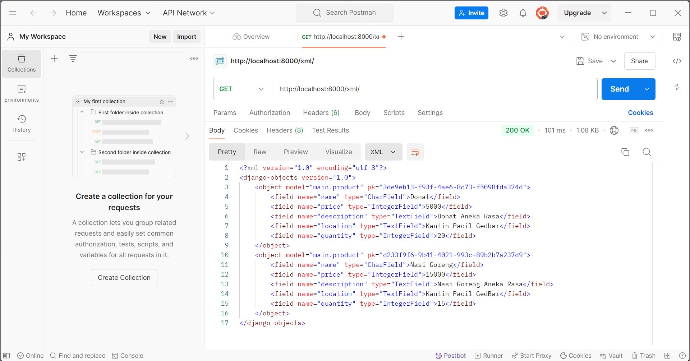
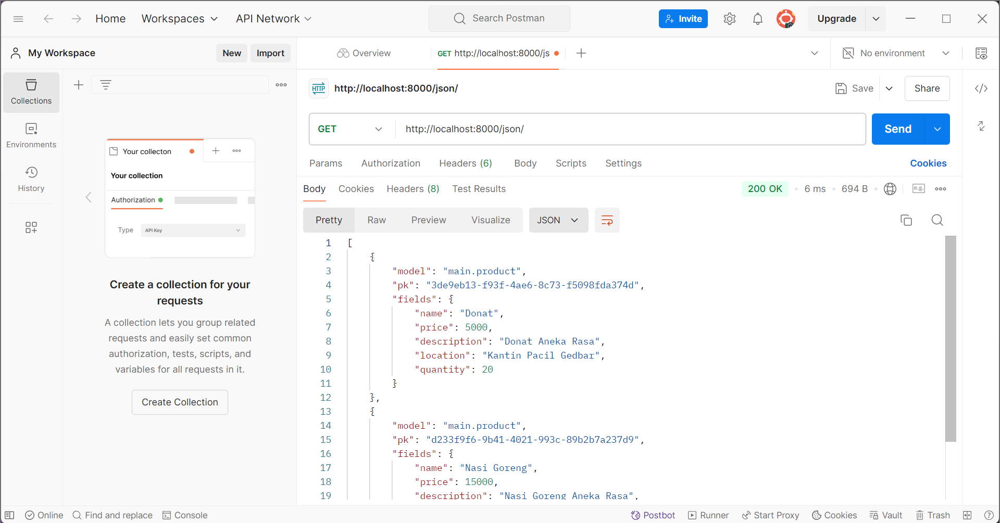
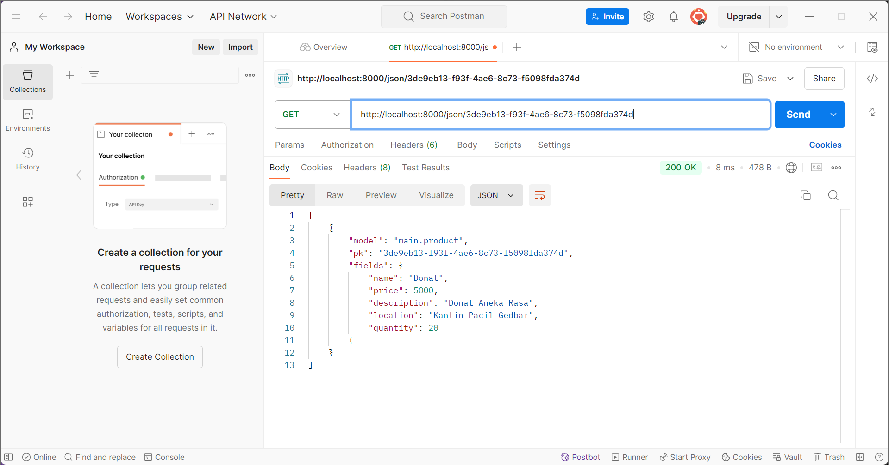

# Hello! Welcome to [*Lazacil*](http://ischika-afrilla-lazacil.pbp.cs.ui.ac.id)
### Siap melayani para lazy pacil 😎🤞

---------------------------------------------------------------------------------------------------------------------------------------------------
> Sebuah proyek Django sederhana sebagai tugas mata kuliah Pemrograman Berbasis Platform (PBP) oleh Ischika Afrilla 2306227955. Proyek ini dibuat dengan sistem operasi Windows.
---------------------------------------------------------------------------------------------------------------------------------------------------

# Daftar Isi
- [Tugas 2](#tugas-2)
- [Tugas 3](#tugas-3)
- [Dokumentasi Postman](#dokumentasi-postman)
- [Tugas 4](#tugas-4)

## Tugas 2
[Back](#daftar-isi)

1. Jelaskan bagaimana cara kamu mengimplementasikan checklist di atas secara *step-by-step* (bukan hanya sekadar mengikuti tutorial).

    Awalnya, saya membuat folder bernama "lazacil" di direktori lokal komputer dan membuka *Command Prompt* (cmd) di dalam direktori tersebut untuk membuat *virtual environment*. Setelah itu, saya membuat file `requirements.txt` yang berisi daftar *dependencies* yang diperlukan. Setelah proyek Django "lazacil" dibuat, saya mengonfigurasi bagian `ALLOWED_HOSTS` di file `settings.py`, menjalankan server, dan mengakses *localhost* untuk memastikan proyek berjalan dengan baik.

    Setelah semua konfigurasi awal selesai, saya menghentikan server, menonaktifkan *virtual environment*, dan menambahkan file `.gitignore`. Kemudian, saya mengunggah kode proyek ke GitHub. Selanjutnya, saya mengakses halaman PWS (Pacil Web Service), membuat proyek baru dengan nama "lazacil", dan menambahkan URL deployment PWS ke dalam `ALLOWED_HOSTS`.

    Saya melanjutkan dengan melakukan *push* kode ke PWS, memeriksa status proyek, dan memastikan proyek dapat dibuka melalui browser. Setelah itu, saya mengaktifkan kembali *virtual environment* dan membuat aplikasi baru bernama "main" yang saya tambahkan ke `INSTALLED_APPS`. Di dalam aplikasi tersebut, saya membuat folder "template" dan mengisi file `main.html` sesuai desain yang diinginkan.

    Setelah template selesai, saya membuat model dasar di `models.py` dan menjalankan migrasi untuk menerapkan perubahan. Kemudian, saya membuat fungsi `show_main` untuk merender `main.html` menggunakan data yang sesuai. Setelah fungsi tersebut selesai, saya memodifikasi template agar dapat menampilkan variabel yang didefinisikan.

    Saya mengonfigurasi *routing* dengan membuat `urls.py` di dalam aplikasi "main" dan menghubungkannya dengan fungsi `show_main`. Kemudian, saya menambahkan *routing* tersebut ke file `urls.py` di direktori proyek utama dan mengeceknya di *localhost*. Terakhir, saya membuat *unit test* di `main/tests.py`, menambahkan beberapa tes, dan melakukan *push* kode ke GitHub serta PWS.

2. Buatlah bagan yang berisi request client ke web aplikasi berbasis Django beserta responnya dan jelaskan pada bagan tersebut kaitan antara `urls.py`, `views.py`, `models.py`, dan berkas `html`

    

    - Client (Browser) Mengirim HTTP Request

      Client mengirimkan request ke server Django. Permintaan ini bisa berupa request get (meminta data) atau post (mengirimkan data). 
    - urls.py (Routing)

      File `urls.py` bertugas melakukan routing, yaitu menentukan request yang masuk dari URL yang mana akan ditangani oleh view tertentu. 
    - views.py (Logika Program)

      Setelah request diteruskan dari `urls.py`, fungsi yang ada di `views.py` akan dipanggil. View ini berfungsi sebagai logika yang mengatur apa yang harus dilakukan. View bisa mengambil data dari database menggunakan `models.py` (jika diperlukan), kemudian meneruskannya ke template (berkas HTML) untuk dirender, atau langsung mengembalikan respons.
    - models.py (Berinteraksi dengan Database)

      Jika view membutuhkan data dari database, maka view akan berkomunikasi dengan `models.py`. Model bertugas untuk mendefinisikan struktur database, memetakan tabel di database, dan menyediakan fungsi untuk query data.
    - Berkas HTML (Template)

      Setelah data diproses di view, Django akan meneruskannya ke template HTML untuk ditampilkan ke user. Template ini berisi HTML dan bisa menyertakan variabel yang dikirim dari view.
    - HTTP Response

      Setelah template dirender, hasilnya akan dikirim kembali ke client sebagai HTTP Response. Isi dari respons ini biasanya berupa halaman HTML yang dapat ditampilkan di browser.
    - Client (Browser) Menerima HTTP Response

      Setelah server Django mengembalikan respons dalam bentuk HTML, browser akan menampilkan halaman tersebut ke user.

3. Jelaskan fungsi git dalam pengembangan perangkat lunak!

    Fungsi git dalam pengembangan perangkat lunak adalah sebagai berikut.
    - Pengelolaan Versi Kode

      Git memungkinkan *developer* melacak perubahan kode yang dibuat selama proses pengembangan. Setiap perubahan disimpan sebagai *commit* yang berisi informasi tentang apa yang diubah, oleh siapa, dan kapan. Ini membantu dalam memantau dan mengontrol evolusi perangkat lunak dari waktu ke waktu.
    - Kolaborasi Tim

      Git memungkinkan banyak *developer* bekerja pada proyek yang sama secara bersamaan. Dengan fitur *branching* (percabangan), setiap *developer* bisa mengerjakan fitur atau perbaikan tertentu di cabang terpisah tanpa mengganggu kode utama. Setelah selesai, mereka bisa menggabungkan (*merge*) perubahan ke cabang utama (biasanya *main* atau *master*).
    - Pemulihan dari Kesalahan

      Karena Git mencatat setiap perubahan yang dilakukan, *developer* dapat dengan mudah mengembalikan (*revert*) kode ke versi sebelumnya jika ada kesalahan atau bug yang muncul. Ini memberikan keamanan dalam pengembangan karena kode sebelumnya tidak akan hilang.
    - Integrasi dengan Layanan Cloud (GitHub, GitLab, Bitbucket)

      Git memungkinkan *developer* menyimpan proyek mereka di layanan penyimpanan cloud seperti GitHub atau GitLab, yang mendukung pengembangan perangkat lunak secara kolaboratif melalui akses jarak jauh. Hal ini memudahkan tim yang tersebar di berbagai lokasi untuk berkolaborasi secara efektif.
    - Branching dan Merging

      Git menyediakan mekanisme untuk membuat percabangan (*branching*), di mana *developer* bisa mengerjakan fitur baru, melakukan eksperimen, atau memperbaiki bug tanpa mengganggu kode utama. Setelah selesai, percabangan tersebut dapat digabungkan (*merge*) kembali ke cabang utama dengan aman. Ini mendukung pengembangan paralel secara efisien.
    - Manajemen Kontribusi Terbuka

      Dalam proyek perangkat lunak *open-source*, Git sangat berguna karena memungkinkan *developer* dari seluruh dunia untuk berkontribusi. *Developer* bisa melakukan *fork* (menyalin) proyek, mengembangkan perubahan, dan mengirimkan *pull request* untuk menggabungkan kontribusi mereka ke dalam proyek asli.
    - Dokumentasi Perubahan (Commit History)

      Setiap perubahan kode yang dilakukan dalam Git disertai dengan pesan *commit*. Ini membentuk sejarah perubahan (*commit history*) yang memudahkan *developer* lain untuk melihat perkembangan proyek, memahami alasan perubahan tertentu, dan melacak siapa yang mengerjakan apa.
    - Integrasi dengan CI/CD

      Git sering diintegrasikan dengan alat Continuous Integration/Continuous Deployment (CI/CD) seperti Jenkins, Travis CI, atau GitLab CI. Ini memungkinkan otomatisasi pengujian dan *deployment* setiap kali ada perubahan kode yang digabungkan ke cabang utama.

4. Menurut Anda, dari semua framework yang ada, mengapa framework Django dijadikan permulaan pembelajaran pengembangan perangkat lunak?

    Django dijadikan permulaan pembelajaran pengembangan perangkat lunak karena alasan berikut.
    - Pendekatan "Batteries Included" (Fitur Lengkap)

      Django menawarkan banyak fitur bawaan yang lengkap, seperti autentikasi pengguna, pengelolaan URL, ORM (Object-Relational Mapping), dan admin panel. Ini membantu pemula karena mereka tidak perlu memulai dari nol atau mencari banyak *library* tambahan. Dengan Django, mereka dapat langsung fokus pada logika aplikasi, bukan pada hal-hal teknis dasar.
    - Arsitektur yang Terstruktur (MTV Pattern)

      Django mengikuti pola *Model-Template-View* (MTV), yang serupa dengan pola MVC (*Model-View-Controller*). Arsitektur ini membagi aplikasi menjadi beberapa komponen, membuatnya lebih terorganisir dan mudah dipahami. Bagi pemula, ini membantu dalam membangun fondasi yang kuat untuk memahami bagaimana aplikasi web bekerja dan bagaimana memisahkan berbagai bagian dari sebuah aplikasi (data, logika, tampilan).
    - Dokumentasi yang Lengkap

      Django memiliki dokumentasi yang sangat lengkap dan ramah bagi pemula. Banyak materi pembelajaran, tutorial, dan komunitas yang mendukung, yang memudahkan pemula untuk mempelajari Django dengan cepat. Dokumentasi yang baik memastikan bahwa *developer* dapat menyelesaikan masalah mereka tanpa harus bergantung pada sumber eksternal.
    - Keamanan Tinggi

      Django dilengkapi dengan fitur keamanan yang canggih, seperti perlindungan terhadap serangan *SQL Injection*, *Cross-Site Scripting* (XSS), dan *Cross-Site Request Forgery* (CSRF). Bagi pemula, memulai dengan framework yang aman membantu mereka belajar praktik pengembangan aplikasi web yang baik sejak awal.
    - Skalabilitas

      Django tidak hanya cocok untuk proyek kecil, tetapi juga dapat digunakan untuk proyek besar. Ini memungkinkan *developer* yang baru belajar untuk membangun proyek skala kecil, tetapi tetap memberi mereka ruang untuk mengembangkan keterampilan dan proyek mereka ke tingkat yang lebih kompleks di masa depan.
    - Dukungan untuk Proyek Cepat (Prototyping)

      Django memungkinkan *developer* untuk membuat aplikasi yang berfungsi dengan cepat. Dengan fitur seperti ORM, sistem templating, dan admin panel bawaan, *developer* pemula dapat membuat prototipe aplikasi dengan cepat tanpa harus menulis banyak kode dari awal.
    - Berorientasi pada Pengalaman Nyata

      Django digunakan oleh banyak perusahaan besar untuk aplikasi skala besar (seperti Instagram, Pinterest, dan Mozilla). Belajar Django memberi pemula pengalaman langsung dengan alat yang digunakan di industri, sehingga keterampilan yang mereka pelajari langsung relevan dengan pekerjaan nyata.
    - Python sebagai Bahasa Dasar

      Django dibangun menggunakan Python, yang merupakan salah satu bahasa pemrograman paling populer dan mudah dipelajari. Python dikenal karena sintaksnya yang sederhana dan bersih, yang menjadikannya pilihan ideal bagi mereka yang baru memulai pemrograman. Selain itu, popularitas Python di berbagai bidang seperti *data science* dan *machine learning* membuat Django menjadi pilihan yang menarik untuk pengembangan aplikasi web di ekosistem Python.
    - Komunitas yang Besar

      Django memiliki komunitas yang besar dan aktif. *Developer* pemula dapat dengan mudah menemukan jawaban atas masalah mereka melalui forum, kelompok belajar, atau repositori *open-source*. Komunitas yang kuat memberikan dukungan tambahan di luar dokumentasi resmi.
    - Keterampilan yang Mudah Ditransfer

      Setelah mempelajari Django, konsep-konsep seperti pemisahan logika aplikasi dan tampilan, manipulasi database, dan pola desain yang dipakai oleh Django bisa dengan mudah ditransfer ke *framework* lain atau bahkan teknologi lain di luar Python.

5. Mengapa model pada Django disebut sebagai ORM?

    Model pada Django disebut ORM (Object-Relational Mapping) karena Django menggunakan teknik ini untuk memudahkan interaksi antara objek di kode Python dan *database* relasional (seperti MySQL, PostgreSQL, atau SQLite). Dengan ORM, developer bisa bekerja dengan database menggunakan objek dan metode dalam kode tanpa perlu menulis SQL (Structured Query Language), bahasa yang biasa digunakan untuk mengelola *database*. ORM membantu menghubungkan dunia pemrograman berorientasi objek (OOP) dengan tabel di database. Ini membuat pekerjaan *developer* lebih efisien dan interaksi dengan *database* menjadi lebih mudah dan intuitif.

## Tugas 3
[Back](#daftar-isi)

1. Jelaskan mengapa kita memerlukan *data delivery* dalam pengimplementasian sebuah platform?

    *Data delivery* adalah proses pengiriman data dari satu titik ke titik lain, baik antar sistem, aplikasi, atau komponen dalam sebuah platform. *Data delivery* sangat penting dalam pengimplementasian sebuah platform karena memainkan peran kunci dalam memastikan bahwa data yang relevan dan dibutuhkan tersedia tepat waktu, akurat, dan aman bagi pengguna atau sistem lain yang terhubung dengan platform tersebut. Tanpa pengiriman data yang andal dan efisien, platform tidak akan dapat berfungsi secara optimal, mempengaruhi kualitas layanan, keamanan, serta pengalaman pengguna secara keseluruhan.

2. Menurutmu, mana yang lebih baik antara XML dan JSON? Mengapa JSON lebih populer dibandingkan XML?

    Dalam perbandingan antara XML (*eXtensible Markup Language*) dan JSON (*JavaScript Object Notation*), masing-masing memiliki keunggulan dan kelemahan tersendiri. Namun, dalam banyak hal, JSON dianggap lebih baik dan lebih populer daripada XML, terutama dalam konteks *web development* dan API modern karena sintaksis yang lebih sederhana, ukuran data lebih kecil, kinerja *parsing* yang lebih cepat, dukungan luas di API modern, integrasi yang baik dengan JavaScript, tipe data yang lebih kaya dan alami. Sedangkan, XML lebih baik digunakan saat data memerlukan skema yang ketat (*Validation*), data mengandung informasi hirarkis yang kompleks, dan data berbasis teks atau dokumen.

3. Jelaskan fungsi dari method `is_valid()` pada form Django dan mengapa kita membutuhkan method tersebut?

    Method `is_valid()` pada form Django memiliki fungsi utama untuk memeriksa apakah data yang dikirimkan melalui form sesuai dengan aturan validasi yang telah ditetapkan di form tersebut dan menyimpan data yang sudah divalidasi dalam atribut `cleaned_data`. Method ini mengembalikan nilai *True* jika semua data yang dimasukkan valid, dan *False* jika ada kesalahan atau ketidaksesuaian dengan aturan validasi. Saat method `is_valid()` dipanggil, Django akan:
    - Memeriksa apakah semua field yang diperlukan (*required*) telah diisi.
    - Memvalidasi tipe data yang dimasukkan
    - Melakukan validasi khusus

    Method `is_valid()` dibutuhkan untuk:
    - Memastikan pengguna memasukkan data yang tepat
    - Mencegah data yang tidak valid diproses
    - Mendapatkan data yang bersih 

4. Mengapa kita membutuhkan `csrf_token` saat membuat *form* di Django? Apa yang dapat terjadi jika kita tidak menambahkan `csrf_token` pada *form* Django? Bagaimana hal tersebut dapat dimanfaatkan oleh penyerang?

    - Apa itu CSRF (*Cross-Site Request Forgery*)?

      CSRF adalah jenis serangan di mana penyerang memanfaatkan sesi pengguna yang telah diautentikasi di sebuah aplikasi web untuk menjalankan tindakan yang tidak diinginkan, seperti mengubah pengaturan akun, melakukan transaksi, atau mengirimkan data tanpa persetujuan pengguna.

      Misalnya, jika pengguna sudah *login* di sebuah situs perbankan dan membuka halaman berbahaya di tab lain yang dibuat oleh penyerang, halaman berbahaya itu bisa mengirimkan permintaan ke situs perbankan untuk mentransfer uang. Karena browser pengguna mengirimkan *cookie* autentikasi secara otomatis, server perbankan menganggap permintaan tersebut sah, meskipun sebenarnya permintaan itu dikirim oleh penyerang.

    - Mengapa kita membutuhkan `csrf_token` di Django?

      `csrf_token` adalah token unik yang diberikan oleh server kepada *form* HTML untuk memverifikasi bahwa permintaan tersebut berasal dari sumber yang tepercaya (yaitu, dari situs yang sah). Token ini secara acak dihasilkan dan disisipkan ke dalam setiap form yang menggunakan metode POST. Ketika form dikirim, Django akan memverifikasi apakah token yang dikirimkan sesuai dengan token yang dihasilkan sebelumnya. Keberadaan `csrf_token` memastikan bahwa setiap permintaan POST atau form submission yang diterima server benar-benar berasal dari halaman yang dibuat oleh server itu sendiri, bukan dari halaman berbahaya yang dibuat oleh penyerang.

    - Apa yang terjadi jika tidak menambahkan `csrf_token`?

      Jika kita tidak menambahkan `csrf_token` pada form Django, aplikasi web kita menjadi rentan terhadap serangan CSRF. Tanpa perlindungan ini, penyerang dapat dengan mudah memanfaatkan sesi pengguna yang sah untuk melakukan aksi-aksi yang tidak diinginkan.

    - Bagaimana penyerang memanfaatkan ketidakhadiran `csrf_token`?

        - Penyerang membuat halaman berbahaya di situs eksternal yang berisi *form* atau permintaan tersembunyi yang diarahkan ke aplikasi web korban (misalnya, mengirim permintaan POST untuk melakukan transfer uang atau mengubah kata sandi)
        - Penyerang bisa mengelabui pengguna agar mengunjungi halaman tersebut (melalui tautan email, pesan, atau metode *phishing* lainnya). Karena pengguna telah login ke aplikasi web yang sah, browser mereka secara otomatis mengirim *cookie* autentikasi bersama dengan permintaan tersebut.
        - Jika aplikasi tidak memverifikasi asal permintaan dengan menggunakan `csrf_token`, server akan mengeksekusi permintaan tersebut karena browser mengirimkan *cookie* autentikasi pengguna. Hasilnya, penyerang berhasil menjalankan tindakan atas nama pengguna tanpa persetujuan mereka.

    - Bagaimana `csrf_token` mencegah serangan CSRF?

      `csrf_token` mencegah serangan CSRF dengan menambahkan lapisan keamanan tambahan. Setiap *form* di dalam aplikasi yang aman akan berisi token unik yang dihasilkan secara acak oleh server saat halaman *form* dimuat. Token ini juga disimpan di sesi server pengguna. Ketika pengguna mengirimkan *form*, server membandingkan token yang dikirimkan dari *form* dengan token yang disimpan di sesi pengguna. Jika tokennya cocok, permintaan dianggap valid. Jika tidak, permintaan ditolak karena dianggap berasal dari sumber yang tidak sah.

5. Jelaskan bagaimana cara kamu mengimplementasikan *checklist* di atas secara *step-by-step* (bukan hanya sekadar mengikuti tutorial)

    - Membuat `templates/base.html` pada direktori utama (*root folder*) lazacil.
    - Mengedit *templates* pada `lazacil/settings.py` agar `base.html` terdeteksi sebagai *template*.
    - Menambahkan `base.html` sebagai *template* utama pada `main/templates/main.html`.
    - Menghapus berkas basis data (`db.sqlite3`)
    - Mengubah *primary key* menjadi UUID pada `main/models.py`.
    - Melakukan migrasi model kembali.
    - Membuat berkas baru dengan nama `forms.py` pada *main* untuk membuat struktur *form*.
    - Menambahkan `import redirect` pada `main/views.py`.
    - Membuat fungsi `create_product` dengan parameter `request` pada `main/views.py`.
    - Mengedit fungsi `show_main` pada `main/views.py`.
    - Meng*import* fungsi `create_product` pada `main/urls.py`.
    - Menambahkan path URL `create_product` ke dalam `urlpatterns` pada `main/urls.py`.
    - Membuat berkas baru dengan nama `create_product.html` pada `main/templates` dan mengedit `main.html`.
    - Menjalankan pada *localhost* dan mencoba menambahkan beberapa produk.
    - Menambahkan `import HttpResponse` dan `serializers` pada `main/views.py`.
    - Membuat fungsi baru dengan nama `show_xml`, `show_json`, `show_xml_by_id`, `show_json_by_id` pada `main/views.py` lalu import fungsi tersebut ke `main/urls.py` dan menambahkan path URL-nya ke dalam `urlpatterns`.
    - Menjalankan pada *localhost* dan mencoba mengecek hasil datanya.
    - Mengecek pengambilan data pada Postman dan terakhir *push* kode ke GitHub dan PWS.

## Dokumentasi Postman
[Back](#daftar-isi)

### XML

### XML by ID

### JSON

### JSON by ID

## Tugas 4
[Back](#daftar-isi)

1. Apa perbedaan antara `HttpResponseRedirect()` dan `redirect()`?
2. Jelaskan cara kerja penghubungan model `Product` dengan `User`!
3. Apa perbedaan antara *authentication* dan *authorization*, apakah yang dilakukan saat pengguna login? Jelaskan bagaimana Django mengimplementasikan kedua konsep tersebut!
4. Bagaimana Django mengingat pengguna yang telah login? Jelaskan kegunaan lain dari *cookies* dan apakah semua *cookies* aman digunakan?
5. Jelaskan bagaimana cara kamu mengimplementasikan *checklist* di atas secara *step-by-step* (bukan hanya sekadar mengikuti tutorial)!